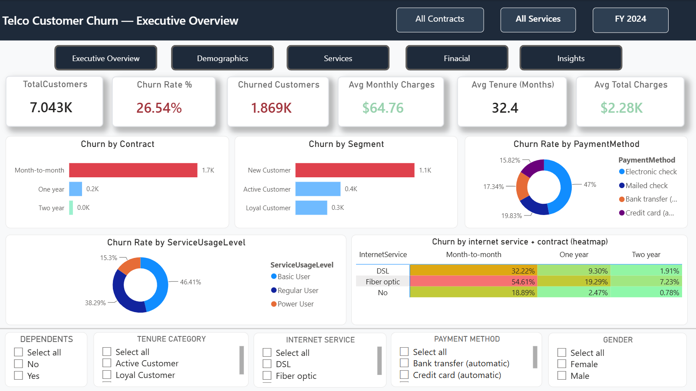
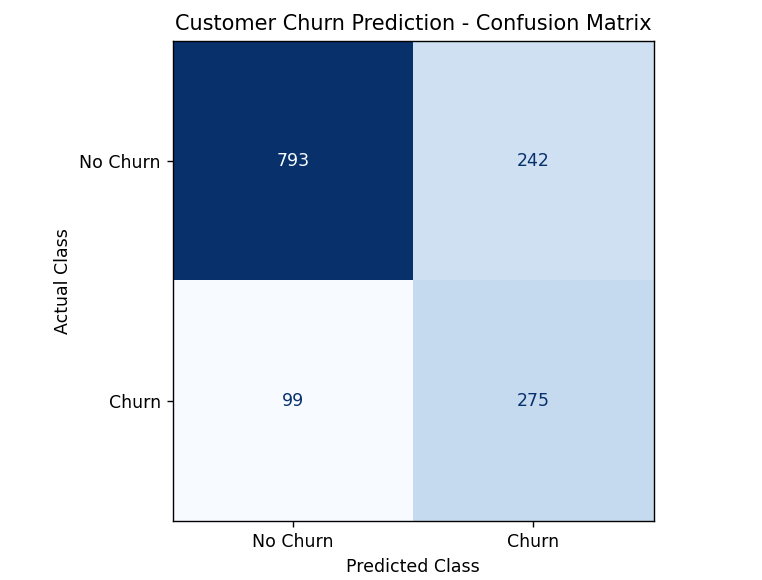

# Customer Churn Prediction & Analytics

#Live Demo
https://customer-churn-predictive-modell.streamlit.app/

## Project Overview

Customer churn is one of the most critical business challenges for subscription-based companies. This project combines Business Intelligence, SQL Analytics, Machine Learning, and Streamlit Deployment to identify customers at risk of leaving and provide actionable insights for retention strategies.

The project follows a complete end-to-end analytics workflow:

* Data Cleaning & Preprocessing
* Exploratory Data Analysis
* SQL Business Analysis
* Power BI Dashboard Development
* Feature Engineering
* Machine Learning Modeling
* Threshold Optimization
* Model Deployment using Streamlit

---

## Business Problem

Customer acquisition is significantly more expensive than customer retention. The objective of this project is to identify customers likely to churn and help businesses take proactive retention actions.

---

## Tools & Technologies

### Data Analytics

* SQL
* Power BI
* Microsoft Excel

### Data Science & Machine Learning

* Python
* Pandas
* NumPy
* Scikit-Learn
* LightGBM
* SMOTE

### Visualization

* Matplotlib
* Seaborn
* Power BI

### Deployment

* Streamlit
* Joblib

---

## Key Business Insights

### High-Risk Customer Segments

* Month-to-Month Contract Customers showed the highest churn rate.
* Electronic Check users exhibited significantly higher churn.
* Fiber Optic customers experienced elevated churn levels.
* New Customers demonstrated the highest probability of leaving.
* Senior Citizens showed higher churn rates compared to non-senior customers.

---

## Feature Engineering

Custom features created:

### TotalServices

Aggregates customer service subscriptions into a single engagement metric.

### RiskScore

Business-driven risk indicator based on:

* Month-to-Month Contract
* Electronic Check Payment
* Fiber Optic Internet Service
* Senior Citizen Status
* Low Customer Tenure

---

## Machine Learning Pipeline

### Models Evaluated

* Random Forest Classifier
* LightGBM Classifier

### Class Imbalance Handling

* SMOTE Oversampling

### Hyperparameter Optimization

* RandomizedSearchCV

### Threshold Tuning

Default threshold (0.50) was optimized to 0.30 to improve churn detection performance.

---

## Final Model Performance

* Accuracy: 74.2%
* Precision: 50.9%
* Recall: 79.1%
* F1 Score: 62.0%
* ROC-AUC Score: 83.0%

The model prioritizes customer churn detection by maximizing recall while maintaining a balanced F1 score.

---

## Deployment

The final model was serialized using Joblib and deployed through an interactive Streamlit application where users can:

* Enter customer information
* Calculate churn probability
* Identify high-risk customers
* Support retention decision-making

---

## Project Workflow

Data Collection
→ Data Cleaning
→ SQL Analysis
→ Power BI Dashboard
→ Feature Engineering
→ Machine Learning
→ Threshold Tuning
→ Model Evaluation
→ Streamlit Deployment

---

## Dashboard

## Confusion Matrix

## Feature Importance

